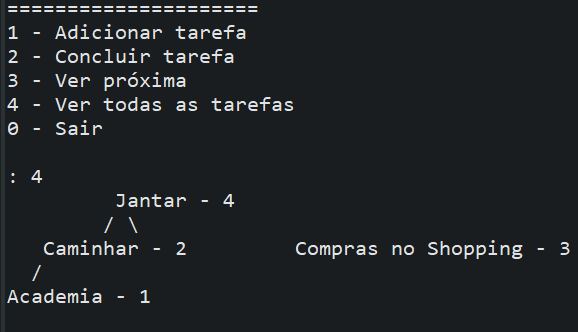

# Gerenciador de tarefas com MaxHeap
Projeto em Java que visualiza estruturas de dados do tipo **Heap** de forma gráfica no console, com diferentes modos de exibição.

## ✨ Funcionalidades

- **Visualização em 3 modos**:
  1. Prioridades apenas (`modoVisualizacao = 1`)
  2. Descrições apenas (`modoVisualizacao = 2`)
  3. Prioridades + Descrições (`modoVisualizacao = 3`)
- **Representação gráfica** da árvore heap com indentação e conexões entre nós.
- **Suporte a heaps vazias** (com mensagem explicativa).

## 📊 Exemplo de Saída
  
*(Imagem ilustrativa: substitua pelo screenshot real do seu projeto)*

## 👥 Autores:
<table>
    <tr>
        <td align="center">
            <a href="https://github.com/CCodekey">
                 
                
                    <b>Gabriel Tertuliano</b>
                
            </a>
        </td>
        <td align="center">
            <a href="https://github.com/emidio-007/">
                 
                
                    <b>José Emídio</b>
                
            </a>
        </td>
        <td align="center">
            <a href="https://github.com/kaleu-victor">
                 
                
                    <b>Kaléu Victor</b>
                
            </a>
        </td>
              <td align="center">
            <a href="https://github.com/kauaamorim07">
                 
                
                    <b>Kauã Amorim</b>
                
            </a>
        </td>
    </tr>
</table>
